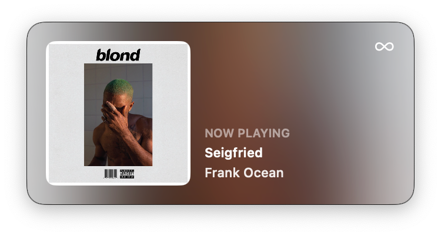
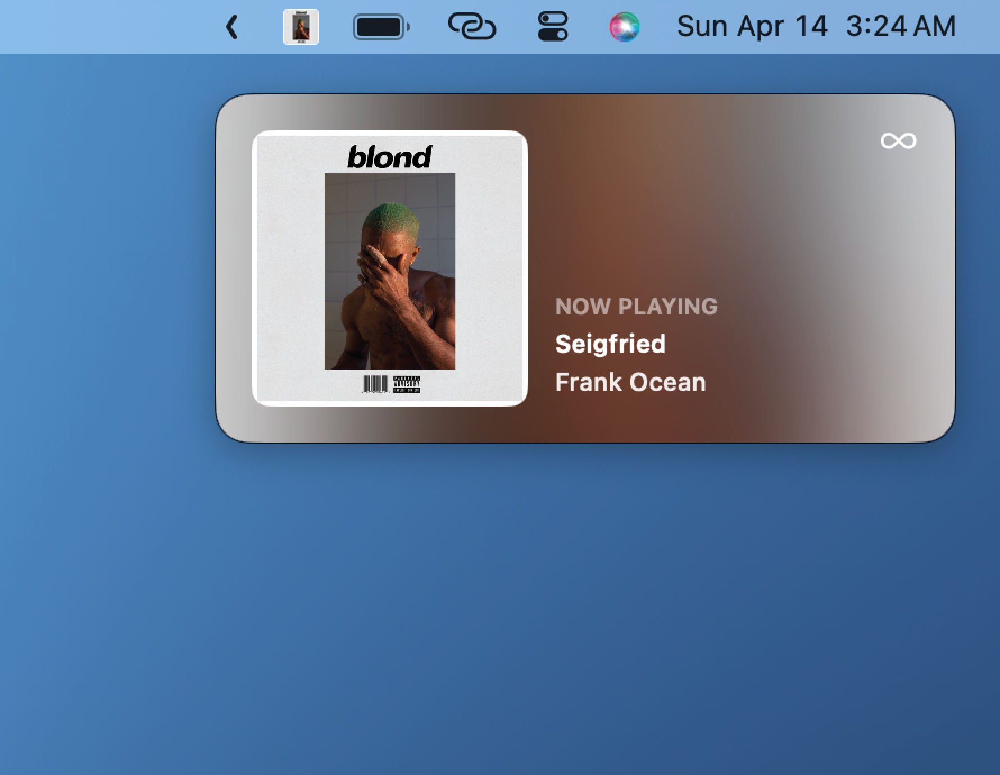
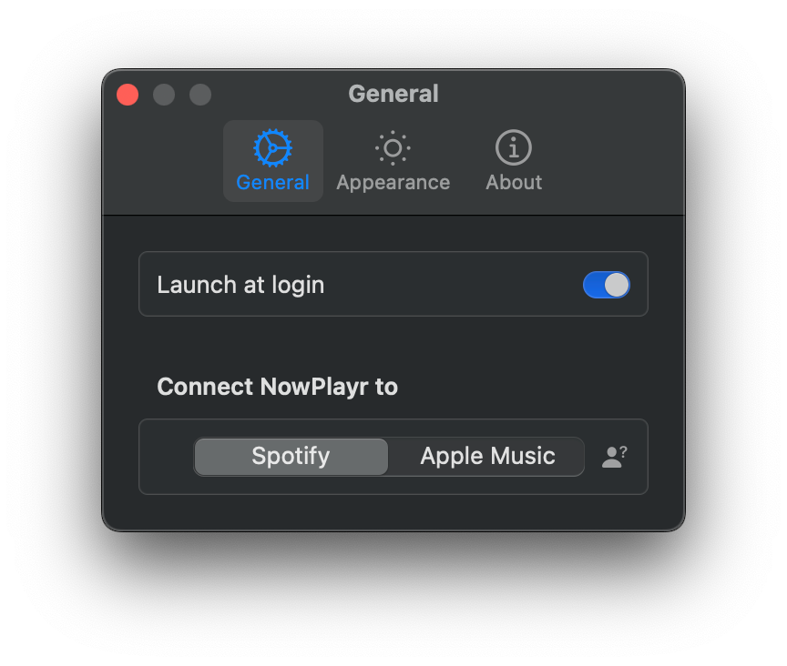
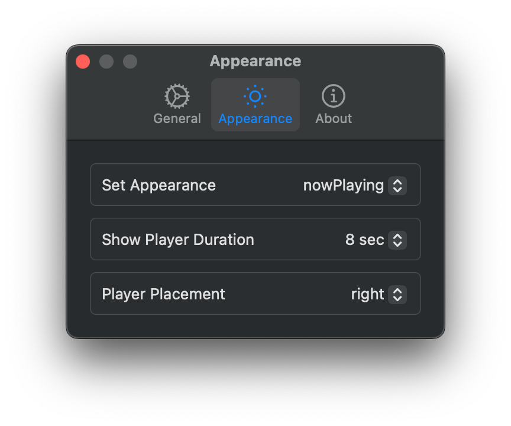

  

  <h3 align="center">NowPlayr</h3>

  

    NowPlayr. The beautiful, sleek, open-source music preview for macOS. Your music, at a glance..
     
    <a href="https://briannewton.dev/NowPlayr/">Website</a>
    ·
    <a href="https://github.com/CozyBrian/NowPlayr/issues">Report Bug</a>
    ·
    <a href="https://github.com/CozyBrian/NowPlayr/issues">Request Feature</a>
  

# About

NowPlayr offers an easy method to manage music playback for Spotify and Apple Music, displaying the currently playing track with the Now Playing Window or controling play back with the floating player.

**NowPlayr requires macOS 14 Sonoma or greater.**

## Screenshots

  

  
  

  

## Settings

  
  

## Features

### 1. Playback Control
NowPlayr seamlessly integrates with both Spotify and Apple Music. Easily control your music from floating player window and see currently playing song and/or artist directly.

### 2. Quick Glance
NowPlayr comes with a non-intrusive Now Playing banner that appears whenever your music changes, showing the currently playing song and allowing you to focus on your work without missing a beat. 

## Installation

1. Download the latest release from the [Releases](https://github.com/CozyBrian/NowPlayr/releases/) page.
2. Open the downloaded `.dmg` file and drag the app to your Applications folder.
3. Launch the app, select you preferred streaming service and enjoy!

## Feedback

Your feedback is important to us. If you encounter any issues or have suggestions for improvement, please [open an issue](https://github.com/CozyBrian/NowPlayr/issues).

## Acknowledgments

- Project is partly based on [Jukebox](https://github.com/Jaysce/Jukebox/tree/main)
- This project makes use of [LaunchAtLogin](https://github.com/sindresorhus/LaunchAtLogin)
- Settings window is using [Settings](https://github.com/sindresorhus/Settings) Swift package

---

*Thank you for using NowPlayr!*